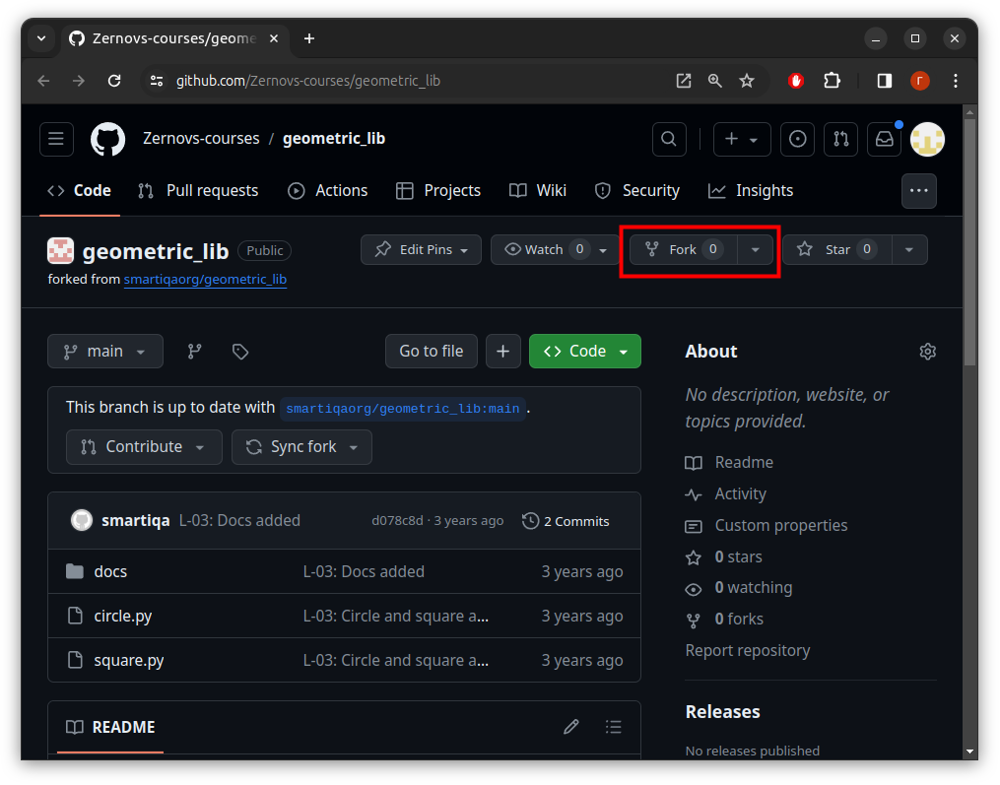
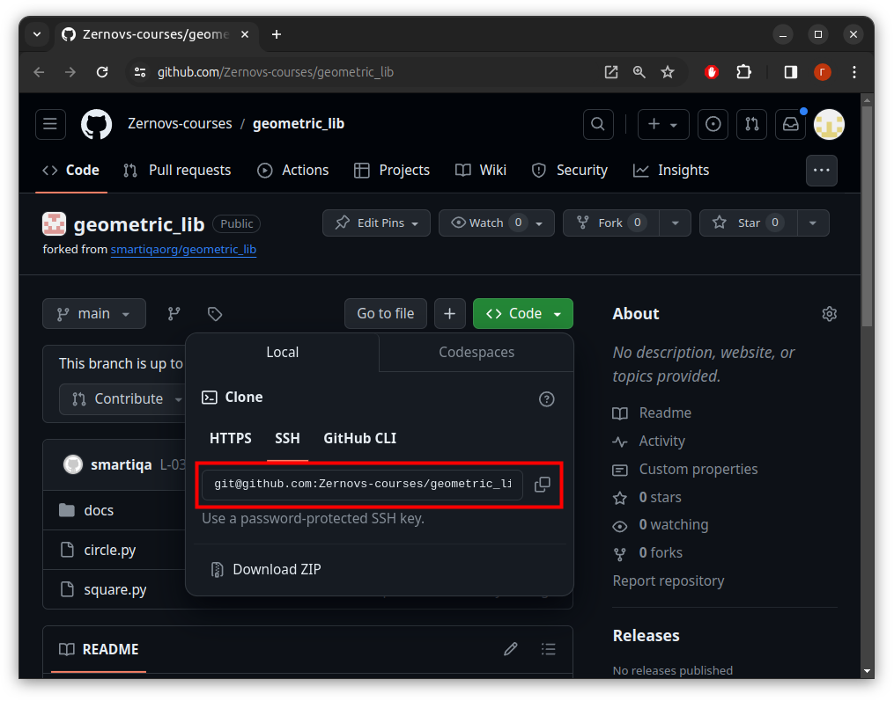
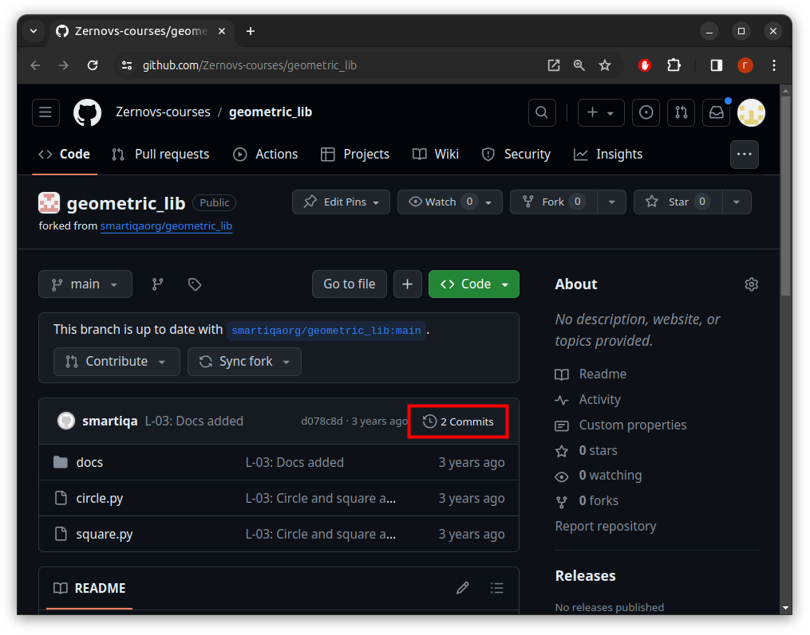
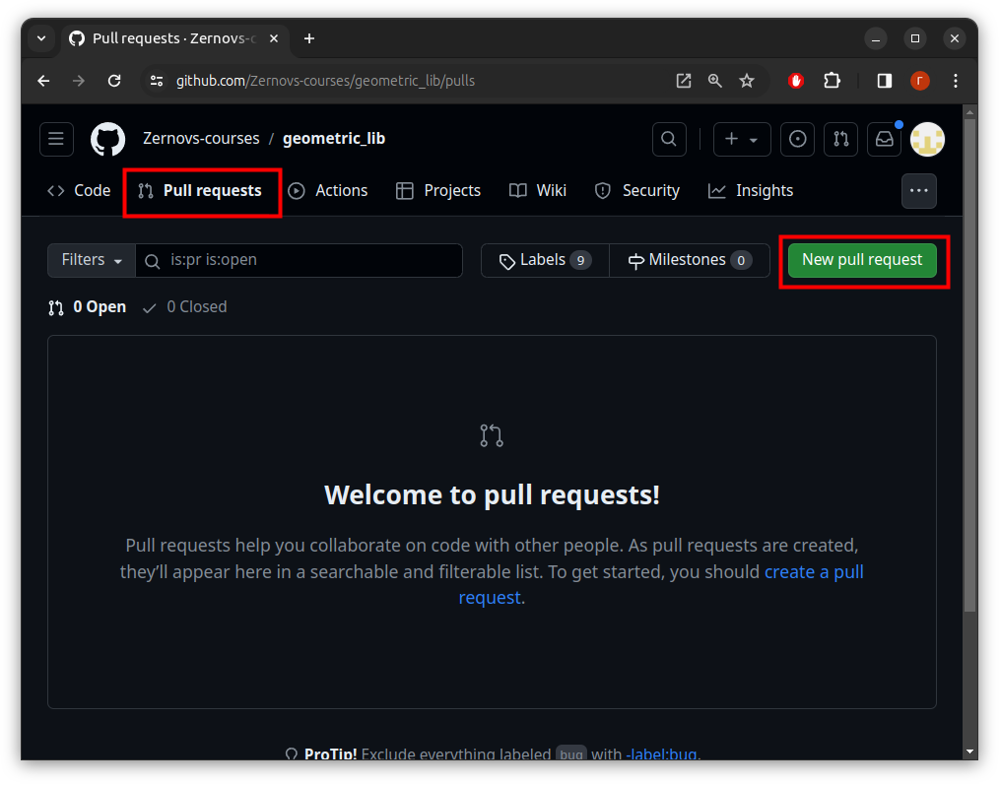

# Задание 3 для курса "Программирование на языке Python"

# Знакомство с Git 2

1. [Задача 3.1](#задача-31)
2. [Задача 3.2](#задача-32)
3. [Задача 3.3](#задача-33)

## Задача 3.1

**Команды: git restore, git rm, git reset, git checkout, git commit, git revert**

1. Клонирование репозитория и знакомство с его структурой
    1. Выполните `git clone https://github.com/Zernovs-courses/geometric_lib.git`. 
    Эта команда создаст директорию `geometric_lib/` на вашем компьютере и скопирует удаленный репозиторий. 
    Не забудьте перейти в эту директорию командой `cd geometric_lib`, когда клонирование будет завершено.
    Кстати, когда вы склонируете к себе репозиторий, у вас будет только одна локальная ветка: `main`. 
    Чтобы создать остальные, нужно выполнить `git checkout <имя ветки>`. 
    Эта команда переключит вас на коммит, на который указывает удаленная ветка и создаст там локальную ветку с таким же именем. 
    Эту команду нужно запустить для каждой ветки отдельно. 
    То есть у вас получится два запуска: для ветки `feature` и ветки `develop`.

    2. Постройте полный граф истории, чтобы познакомиться со структурой комитов.

2. Работа с веткой `feature`
    
    В последнем коммите ветки `feature` допущена ошибка. Откатите этот неудачный коммит.

3. Работа с веткой `develop`
    
    Теперь заметьте, что у нас есть два коммита в ветке `develop` одной и той же тематики: `"L-04: Add calculate.py"`, `"L-04: Update docs for calculate.py"`. 
    
    Объедините их в один коммит и напишите к нему пояснение.

4. Эксперименты. Работа с файлами `calculate.py` и `rectangle.py` в ветке `experiments`
    
    Ветку `develop` мы привели в порядок. 
    
    Теперь давайте представим, что мы хотим протестировать совместную работу файлов `calculate.py` и `rectangle.py`. 
    
    Чтобы не мешать работе других файлов, создадим отдельную ветку `experiment`, которая будет брать начало в конце ветки `main`. 
    
    Новая ветка будет хранить коммиты с результатами наших экспериментов.

    1. Создайте новую ветку с именем `experiment`. 
    Как было сказано выше, она пригодится нам, чтобы хранить наши экспериментальные коммиты.

    2. Мы хотим провести эксперименты с файлом `calculate.py`, но текущая документация (файл `docs/README.md`) устарела. 

        Добавьте в нашу рабочую копию документацию, которая содержит информацию о файле `calculate.py`. 

        Такая есть, например, в последнем коммите ветки `develop`. 
        
        Для этого скопируйте файл `docs/README.md` из последнего коммита ветки `develop` в рабочую копию. 
        
        **Подсказка**: указатель `develop` находится на последнем коммите ветки `develop`.

    3. Добавьте в индекс и рабочую копию файл `calculate.py` из последнего коммита ветки `develop`.

    4. Добавьте все нужные файлы в индекс и сделайте коммит.

    5. Мы поняли, что файлы `circle.py` и `square.py` могут помешать чистоте наших экспериментов. 

        Удалите их и сделайте коммит.

## Задача 3.2

**Команды: git merge, git rebase**

1. Выполните `git clone https://github.com/Zernovs-courses/geometric_lib.git` и перейдите в клонированный репозиторий.

2. Работа с веткой `develop`
    
    1. Влейте ветку `develop` в ветку `main` явным образом (с созданием merge-коммита).
    
    2. Удалите коммит слияния, чтобы затем выполнить слияние в fast-forward режиме.
    
    3. Влейте ветку `develop` в ветку `main` неявным образом (без создания merge-коммита - в режиме fast-forward).

3. Работа с веткой `release`
    1. Выполните интерактивный ребейз ветки `release` на ветку `main` - объедините все коммиты в один и поменяйте их общее сообщение. 
    
        Разрешите конфликты.
    
    2. Выполните fast-forward слияние ветки release в ветку main.

## Задача 3.3

**Команды: git clone, git fetch, git push, git pull**

1. Перейдите на страницу https://github.com/Zernovs-courses/geometric_lib.git и создайте свой форк.

    

2. Склонируйте к себе свой форк репозитория `geometric_lib`.

    

4. Измените файл `docs/README.md`. Сделайте коммит.

5. Выполните пуш ваших изменений в свой удаленный репозиторий. Заметьте, что вам не нужно добавлять удаленный репозиторий: он уже был добавлен под именем `origin` во время клонирования.

6. Откройте страницу вашего репозитория на GitHub. Можете убедиться, что изменения были успешно загружены в удаленный репозиторий, просмотрев историю коммитов на главной странице репозитория.

    

7. Создайте пулл-реквест. В нем подробно опишите внесенные изменения. На странице предпросмотра пулл-реквеста проверьте, что вы не затронули файлы на других ветках и еще раз перепроверьте код

    